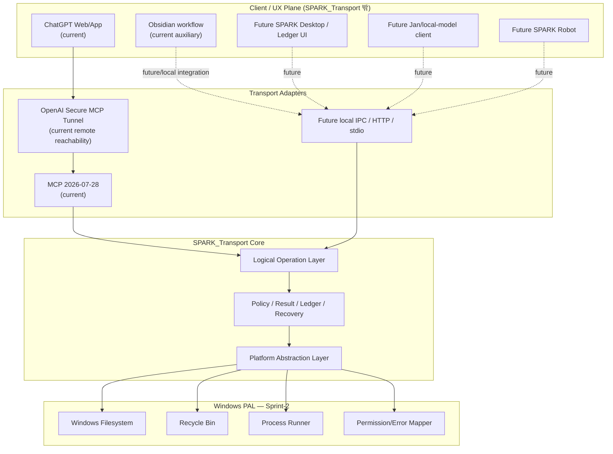

# ARCH — SPARK_Transport

**Version:** 0.0.0  
**Status:** Sprint-2 Architecture Baseline  
**Architecture review:** 2026-09-12

## 1. Purpose and Product Boundary

SPARK_Transport는 특정 AI UI나 특정 모델에 종속된 coding agent가 아니라, **reasoning client와 local machine 사이의 transport/execution substrate**를 제공한다.

현재 첫 번째 client는 ChatGPT Web/App이며 OpenAI Secure MCP Tunnel을 통해 연결한다. 그러나 ChatGPT message quota를 사용하여 model API 비용을 피하는 방식은 **현재 client strategy 중 하나**이지 SPARK_Transport core의 제품 경계가 아니다.

향후 client/UX는 ChatGPT Web/App, Obsidian 기반 workflow, SPARK 전용 desktop UI, Jan과 같은 local-model/MCP host, 별도 SPARK Robot UI로 교체 또는 병행될 수 있다. 따라서 core domain은 ChatGPT, Obsidian, 특정 theme/chat UI를 알지 않는다.

## 2. Architecture Principles

1. **Client/UX independent** — ChatGPT는 현재 client이지 core dependency가 아니다.
2. **Transport independent core** — MCP는 현재 transport adapter이며 domain logic과 분리한다.
3. **OS independent core** — OS-specific 동작은 PAL(Platform Abstraction Layer) 아래에 둔다.
4. **Windows-first PoC** — Sprint-2/0.0.1 PoC는 Windows PAL만 구현한다. macOS/Linux/Android PAL은 TBD다.
5. **Logical operation before physical operation** — `delete_path`, `run_command` 같은 logical operation을 먼저 정의하고 실제 Recycle Bin/process API는 PAL에서 매핑한다.
6. **Fail closed + explicit report** — 실패 시 권한 상승이나 destructive fallback을 하지 않으며, AI와 사용자 모두가 결과를 확인할 수 있어야 한다.
7. **No hidden elevation** — UAC/RunAs/takeown/icacls 등 자동 권한 상승을 하지 않는다.
8. **Recoverability** — overwrite/modify는 recovery metadata를 남기고 delete는 가능한 경우 recoverable delete로 구현한다.
9. **Bounded execution** — command는 timeout, process-tree ownership, bounded stdout/stderr를 갖는다.
10. **User-visible ledger** — chat transcript만을 operation history로 간주하지 않는다.
11. **Large-output indirection** — 큰 log/report는 local storage에 남기고 model에는 summary + handle을 반환할 수 있게 한다.
12. **No model API dependency in SPARK_Transport** — daemon 자체는 OpenAI/Anthropic model API를 호출하지 않는다.

## 3. System Context



## 4. Layer Model

### 4.1. Client / UX Plane

SPARK_Transport core 외부다. Prompt/task composition, conversation rendering, approvals/notifications, operation ledger visualization, side-by-side/task-oriented UX, model/provider 선택을 담당한다. 현재 ChatGPT Web/App가 이 역할을 맡지만 향후 SPARK UI가 대체할 수 있다.

### 4.2. Transport Adapter Layer

현재 transport는 MCP `2026-07-28` + Streamable HTTP + OpenAI Secure MCP Tunnel이다.

- MCP tool schema는 logical operation을 노출한다.
- MCP-specific request/response 처리는 domain/PAL에 침투하지 않는다.
- 향후 local UI를 위해 local HTTP/IPC/stdio adapter를 추가할 수 있다.

### 4.3. Logical Operation Layer

#### FileService

- `list_directory`
- `read_file`
- `create_file`
- `write_file`
- `modify_file`
- `create_directory`
- `copy_path`
- `move_path`
- `delete_path`

#### ProcessService

Sprint-2의 `run_command`는 **simple CLI/process execution**만 담당한다.

- `run_command`
- future: `start_process`
- future: `process_status`
- future: `process_output`
- future: `stop_process`

GUI screen/mouse/keyboard 제어는 이 layer에 포함하지 않으며 다음 Sprint의 별도 Computer subsystem으로 둔다.

#### StatusService

- health
- capabilities
- lifecycle status
- recent operation results
- future: long-output/report handles

### 4.4. Policy / Result / Ledger / Recovery Layer

MCP와 OS 사이에서 공통 semantics를 보장한다.

- allowed-root authorization
- operation capability check
- path canonicalization / traversal / symlink/junction defense
- mutation recovery
- normalized result
- user-visible operation ledger
- secret separation
- future approval policy

### 4.5. PAL — Platform Abstraction Layer

Core가 OS API를 직접 호출하지 않도록 한다.

Target ports:

```text
PlatformFilePort
PlatformTrashPort
PlatformProcessPort
PlatformPermissionPort
PlatformInfoPort
```

Future 후보:

```text
PlatformNetworkPolicyPort
PlatformComputerPort
```

Sprint-2에서는 **Windows PAL만 구현**한다.

## 5. Authorization Model

### 5.1. Working directory와 authorization root를 분리

`cwd`는 편의상 command의 시작 위치일 뿐 security boundary가 아니다.

```text
workingDirectory != authorizationRoot
```

현재 PoC는 single allowed root로 시작하지만 core contract는 multi-root/capability로 확장 가능해야 한다.

Future capability 예:

```text
observe      = read
edit         = read/write
develop      = read/write/simple command
full_control = explicit high-trust profile
deny         = deny
```

### 5.2. Filesystem operation

File operation은 logical layer의 path를 canonicalize한 후 authorization root 안인지 검증한다.

필수 negative cases:

- `..`
- absolute/drive-qualified escape
- UNC escape
- symlink escape
- NTFS junction escape
- non-existing target의 parent-chain escape

### 5.3. Command execution

**native process의 `cwd`를 allowed root로 설정하는 것은 OS sandbox가 아니다.**

Sprint-2 PoC 정책:

- `run_command` = native, non-elevated execution
- current-user token 사용
- network = host environment inherited
- admin/UAC 자동 상승 없음
- command 결과와 위험성을 사용자에게 명시
- public/distribution-grade OS containment을 주장하지 않음

따라서 `run_command`는 **trusted local PoC capability**로 명시하며 향후 distribution-grade execution backend는 별도 ADR로 검토한다.

## 6. Normalized Result Model

모든 logical operation은 공통 result envelope를 반환한다.

```json
{
  "ok": false,
  "operationId": "op-...",
  "operation": "delete_path",
  "summary": "Deletion was not performed.",
  "changed": false,
  "data": {},
  "error": {
    "code": "PERMISSION_DENIED",
    "message": "The operating system denied the operation.",
    "platformCode": "EACCES"
  },
  "durationMs": 12,
  "requiresElevation": true,
  "retryable": false
}
```

필수 원칙:

- 성공/실패가 항상 명시적이어야 한다.
- mutation은 `changed`를 반환한다.
- 실패 시 silent retry/elevation/fallback을 하지 않는다.
- OS error를 normalized SPARK error로 변환한다.
- MCP `structuredContent`와 user-facing summary가 동일한 operation ID를 공유한다.

주요 normalized codes:

- `NOT_FOUND`
- `ALREADY_EXISTS`
- `INVALID_ARGUMENTS`
- `OUTSIDE_ALLOWED_ROOT`
- `PATH_TRAVERSAL`
- `SYMLINK_ESCAPE`
- `PERMISSION_DENIED`
- `ELEVATION_REQUIRED`
- `RECOVERY_FAILED`
- `COMMAND_START_FAILED`
- `COMMAND_FAILED`
- `COMMAND_TIMEOUT`
- `UNSUPPORTED`

## 7. Operation Ledger

AI에게 tool result만 반환하는 것으로 끝내지 않는다. 각 operation은 local ledger에도 기록한다.

권장 record:

```text
operationId
timestamp
client/session
operation
target
status
changed
duration
errorCode
shortSummary
```

예:

```text
09:01:22  READ    README.md       SUCCESS
09:01:40  WRITE   test.txt        SUCCESS  changed=yes
09:02:14  DELETE  protected.txt   FAILED   changed=no  PERMISSION_DENIED
```

`SPARK_Transport status`는 daemon/tunnel 상태와 함께 최근 operation을 표시할 수 있게 확장한다. Future SPARK UI에서는 conversation과 operation ledger를 side-by-side 또는 task ledger 형태로 표시할 수 있다.

## 8. Recovery and Private State

Recovery, approval, secret, audit state는 agent가 자유롭게 수정할 수 있는 workspace와 논리적으로 분리되어야 한다.

Target:

```text
<private SPARK state>
  secrets/
  recovery/
  ledger/
  runtime/
```

Windows target location은 향후 `%LOCALAPPDATA%\SPARK_Transport\...` 같은 user-private state directory를 검토한다.

Sprint-2 PoC의 repo-local `.runtime`은 구현 편의를 위한 transitional state이며, allowed root와 겹치는 배치에서는 authority/recovery state로 사용하지 않도록 후속 refactor가 필요하다.

## 9. Windows PAL — Sprint-2

### 9.1. File

Node filesystem API 또는 동등 backend를 이용하되 core는 PAL interface만 호출한다.

### 9.2. Recoverable Delete

Core semantics:

```text
delete_path = recoverable delete request
```

Windows mapping:

```text
PlatformTrashPort.delete()
  -> Windows Recycle Bin
```

Recycle Bin이 실패하면 permanent delete로 fallback하지 않는다.

### 9.3. Process

CatDesk의 Windows process-runner design을 주요 reference로 한다.

PoC target:

- non-elevated current-user process
- Windows Job Object 기반 process-tree ownership
- timeout 시 whole tree termination
- request cancellation/drop 시 orphan process 방지
- bounded stdout/stderr
- exit code / duration / timeout flags
- GUI automation 없음

### 9.4. Permission/Error Mapping

Win32/Node/PowerShell error를 SPARK normalized error code로 변환한다.

## 10. Transport and Deployment

Current path:

```text
ChatGPT Web/App
  -> OpenAI Secure MCP Tunnel
  -> tunnel-client
  -> 127.0.0.1:8765/mcp
  -> SPARK_Transport
```

Rules:

- daemon bind = loopback by default
- tunnel-client default = `tools/tunnel-client/tunnel-client.exe`
- secrets = literal value가 아니라 `env:`/`file:` reference
- public lifecycle surface = `SPARK_Transport start|status|stop|validate`

## 11. Source Architecture Study — Adopt / Reject

Detailed evidence는 `ARCH_REFERENCE_STUDY.md`에 기록한다.

### CatDesk — Primary implementation reference

Adopt:

- canonical workspace path handling
- process-tree ownership
- Windows Job Object
- bounded output
- timeout/cancellation cleanup
- Linux와 Windows의 backend 분리
- logical file operation과 shell command의 역할 분리

Do not adopt directly:

- large monolithic MCP/main modules
- current product-specific widget/mascot/browser scope
- Windows command execution을 OS sandbox라고 간주하는 것

### Local Coding Agent — Policy/UX reference

Adopt conceptually:

- working directory와 authorization roots 분리
- root capability profile
- canonicalization of non-existing targets
- approval/private authority state를 writable root 밖에 두는 원칙
- local-only dashboard/operation visibility
- large report local storage + compact model result

Do not copy directly:

- AGPL source code unless license strategy explicitly accepts it
- regex command blocklist를 primary security boundary로 사용하는 방식
- monolithic server implementation

### ChatGPT Local Coder — Result/session/UI reference

Adopt:

- `{ok, tool, summary, data}` style structured result concept
- activity/audit stream
- process lifecycle tool decomposition
- MCP session/admin UI separation

Reject as security baseline:

- current source의 full-machine open path/command model
- unrestricted absolute paths

### Jan — Future client/UI reference

Jan은 local model을 직접 실행하고 MCP host 및 local OpenAI-compatible API server를 제공하는 separate client architecture reference다.

Adopt as future UX inspiration:

- provider-neutral UI
- MCP host separation
- local-model path
- Tauri desktop architecture
- UI와 tool/provider backend 분리

Jan의 cloud GPT/Claude provider는 provider API를 사용하므로 현재 ChatGPT consumer message quota를 그대로 사용하는 대체 UI는 아니다.

## 12. GUI / Computer Use Scope

**Sprint-2에서 제외한다.**

다음 Sprint 이후 별도 subsystem:

```text
ComputerService
  -> PlatformComputerPort
     -> Windows capture/input/window backend
```

screen/mouse/keyboard/video/keyframe 문제는 현재 CRUD + simple execution PoC 완료 후 다룬다.

## 13. Sprint-2 / 0.0.1 Small PoC Scope

### In scope

- Windows PAL
- list/read/create/write/modify
- directory create
- copy/move/rename
- recoverable delete
- simple native command execution
- timeout/process-tree cleanup
- bounded stdout/stderr
- normalized result
- explicit user-visible failure
- operation ledger
- unified lifecycle command
- Secure MCP Tunnel E2E regression

### Out of scope / TBD

- GUI Computer Use
- macOS PAL
- Linux PAL
- Android PAL
- elevated helper
- distribution-grade OS command sandbox
- alternate SPARK desktop UI implementation
- SPARK Robot implementation
- local model/provider integration

## 14. Architecture Decisions

| ADR | Decision |
|---|---|
| ADR-001 | MCP `2026-07-28` standard-only |
| ADR-002 | MCP는 transport adapter이며 core domain이 아니다 |
| ADR-003 | reasoning client/UI는 SPARK_Transport core 밖에 둔다 |
| ADR-004 | logical operation과 physical OS operation을 PAL로 분리 |
| ADR-005 | Sprint-2 PAL은 Windows only; macOS/Linux/Android = TBD |
| ADR-006 | FileService와 ProcessService를 분리 |
| ADR-007 | `run_command`는 Sprint-2에서 simple native CLI execution만 담당 |
| ADR-008 | GUI/Computer Use는 다음 Sprint로 이관 |
| ADR-009 | working directory와 authorization root를 분리 |
| ADR-010 | fail closed + normalized result + user-visible ledger |
| ADR-011 | delete core semantics는 recoverable delete, Windows PAL은 Recycle Bin |
| ADR-012 | automatic UAC/elevation 금지 |
| ADR-013 | process runner는 timeout + process-tree ownership + bounded output |
| ADR-014 | private authority/recovery state는 writable workspace와 분리하는 방향 |
| ADR-015 | large output은 local report handle 방식으로 확장 가능 |
| ADR-016 | current ChatGPT no-model-API workflow는 client strategy이지 core product boundary가 아님 |

## 15. Quality / Release Gates

0.0.1은 **small PoC milestone**이며 public-distribution security certification이 아니다.

필수 gate:

- CRUD positive tests PASS
- traversal/absolute/symlink/junction negative tests PASS
- delete recoverability Windows verification PASS
- no permanent-delete fallback
- command timeout PASS
- child process-tree cleanup PASS
- stdout/stderr/exit code result PASS
- failure visible to AI and local user ledger
- Web/App Secure MCP Tunnel CRUD + simple execution E2E PASS
- GUI 기능 미포함 확인

## 16. Future Direction

SPARK의 장기 UX는 단순 chat transcript에 묶이지 않는다.

Future client는 다음 view를 독립적으로 배치할 수 있다.

```text
Conversation | Task/Plan
Operation Ledger | Artifacts
Workspace | Status/Approval
```

더 장기적으로는 SPARK Robot이 이 client/UX plane의 한 구현이 될 수 있다. Transport/Core/PAL은 동일하게 재사용한다.

## 17. External References

- CatDesk: https://github.com/Xeift/CatDesk
- Local Coding Agent: https://github.com/LongNgn204/local-coding-agent
- ChatGPT Local Coder: https://github.com/posavr/chatgpt-local-coder
- Jan: https://github.com/janhq/jan
- Jan MCP: https://www.jan.ai/docs/desktop/mcp
- Jan Local API Server: https://www.jan.ai/docs/desktop/api-server
- MCP 2026-07-28: https://blog.modelcontextprotocol.io/posts/2026-07-28/
- OpenAI tunnel-client: https://github.com/openai/tunnel-client

## Baseline Handoff

이 문서의 architecture를 Sprint-2 구현 baseline으로 사용한다.

다음 구현 단계는 **Windows PAL + Result/Ledger + Process Runner contract에 맞춘 refactor 후 CRUD + simple execution PoC를 종료하는 것**이다. GUI/Computer Use는 포함하지 않는다.
