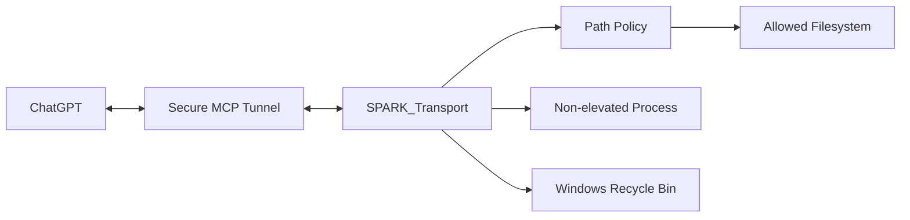
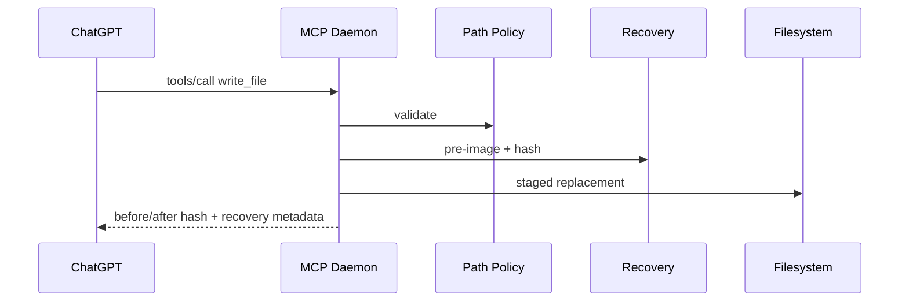

# ARCH — SPARK_Transport

**Version:** 0.0.0  
**Status:** Sprint-2 Candidate

## 1. Introduction and Goals
SPARK_Transport는 ChatGPT custom MCP와 사용자의 로컬 machine 사이에서 allowed-root filesystem operation과 non-elevated command execution을 제공하는 Local MCP daemon입니다. Sprint-2는 Sprint-1 read/list E2E를 유지하면서 mutation, Recycle Bin delete, command execution, config 기반 one-command startup을 추가합니다.

## 2. Constraints
- MCP baseline `2026-07-28`; project-specific protocol extension 금지.
- OpenAI model/Responses API 금지.
- loopback-only listener.
- filesystem tool path는 allowed root 내부로 제한.
- command는 기본 non-elevated.
- delete는 Windows Recycle Bin; permanent fallback 금지.
- tracked config/repository에는 literal secret을 저장하지 않고 `env:` 또는 `file:` secret reference만 사용.

## 3. Context and Scope

Windows Recycle Bin은 allowed root의 하위 directory가 아니다. `delete_path`는 source path를 먼저 allowed-root policy로 검증한 뒤, 현재 사용자 token으로 OS의 Recycle Bin operation만 호출한다. MCP tool로 Recycle Bin 전체 browse/write 권한을 노출하지 않는다.

## 4. Solution Strategy
1. 표준 MCP tool/schema만 사용합니다.
2. path policy를 read/mutation/execution cwd에 공통 적용합니다.
3. write/modify 전 pre-image backup + SHA-256을 남깁니다.
4. command는 `shell:false`; shell 기능은 caller가 명시적으로 실행합니다.
5. delete는 Recycle Bin adapter 실패 시 fail-closed합니다.
6. local JSON config + 단일 `SPARK_Transport` command surface + PowerShell orchestrator로 startup/lifecycle을 자동화합니다.
7. Tunnel runtime secret은 literal value가 아니라 `env:VARNAME` 또는 `file:path` reference로 profile에 전달합니다.

## 5. Building Block View
| Block | Responsibility |
|---|---|
| MCP HTTP Edge | MCP 2026-07-28 validation |
| Tool Runtime | read/create/write/modify/copy/move/delete/exec |
| Path Policy | lexical + realpath containment |
| Recovery Store | mutation pre-image + SHA-256 |
| Recycle Adapter | Windows Recycle Bin OS operation |
| Command Runner | non-elevated spawn/timeout/output |
| Config Loader | JSON + env override + secret reference |
| Startup Orchestrator | daemon/tunnel bootstrap + stage gates |
| `SPARK_Transport.cmd` | `start|status|stop|validate` public command surface |

## 6. Runtime View
### 6.1. Mutation

### 6.2. Delete
`delete_path`는 root confinement 뒤 Windows Recycle Bin adapter만 호출하며 실패 시 permanent delete로 전환하지 않습니다. source delete 권한 또는 Recycle Bin operation 권한이 없으면 operation 자체가 실패합니다.

### 6.3. Command
`run_command`는 confined cwd, explicit executable/args, timeout을 받고 자동 관리자 권한 상승을 하지 않습니다. 단, **cwd confinement만으로 child process의 filesystem access가 allowed root에 제한되는 것은 아닙니다.** child가 absolute path를 인자로 받아 현재 사용자 권한 범위의 다른 파일에 접근할 수 있으므로 0.0.1 승격 전 별도 execution containment policy가 필요합니다.

## 7. Deployment View
Windows PC에서 daemon은 `127.0.0.1:8765`에 bind하고 Secure MCP Tunnel client가 outbound 연결을 유지합니다. 기본 tunnel-client 위치는 repo-relative `tools/tunnel-client/tunnel-client.exe`이며 config로 override 가능합니다. root의 단일 `SPARK_Transport` command가 daemon health와 tunnel readiness를 단계별 검증합니다.

## 8. Cross-cutting Concepts
Containment, recovery, secret separation, structured result, no-elevation, Recycle-Bin-only destructive delete를 공통 정책으로 적용합니다. Secret reference는 `env:` 또는 `file:` 형태만 허용하고 literal key는 tracked config/profile에 기록하지 않습니다.

## 9. Architecture Decisions
| ADR | Status | Decision |
|---|---|---|
| ADR-001 | Accepted | MCP `2026-07-28` standard-only |
| ADR-002 | Accepted | filesystem operation은 allowed-root policy 적용 |
| ADR-003 | Accepted | write/modify recovery backup + hash |
| ADR-004 | Accepted | delete = Windows Recycle Bin, no permanent fallback |
| ADR-005 | Accepted | command = non-elevated + `shell:false` |
| ADR-006 | Accepted | 자동 UAC/RunAs 금지 |
| ADR-007 | Accepted | explicit elevated helper는 실제 requirement 발생 시 별도 설계 |
| ADR-008 | Accepted | machine-local JSON config + secret reference |
| ADR-009 | Accepted | public lifecycle surface = `SPARK_Transport start|status|stop|validate` |
| ADR-010 | Accepted | tunnel-client v0.0.14 full Windows amd64 artifact + SHA256 검증 |
| ADR-011 | Proposed | command execution은 cwd confinement 외 추가 containment policy 필요 |

## 10. Quality Requirements
outside-root filesystem mutation 0, silent permanent delete 0, timeout/output 구조화, startup fail-fast가 목표입니다. Windows Recycle Bin과 ChatGPT mutation/exec는 target evidence가 필요하며 command execution containment는 별도 mandatory blocker입니다.

## 11. Risks and Technical Debt
| ID | Item | Status |
|---|---|---|
| RISK-001 | Windows Recycle Bin target validation | OPEN |
| RISK-002 | Windows unified launcher + tunnel validation | OPEN |
| RISK-003 | UAC-required command error는 command별 상이 | ACCEPTED / fail-closed |
| RISK-004 | child process가 cwd 밖 filesystem에 접근 가능 | BLOCKER before 0.0.1 |
| DEBT-001 | official MCP SDK v2 migration | DEFERRED |
| DEBT-002 | Windows staged replacement semantics 추가 검증 | OPEN |

## 12. Glossary
- allowed root: filesystem MCP tool이 접근 가능한 path boundary.
- Recovery Store: mutation 전 pre-image 저장소.
- non-elevated: 현재 사용자 token으로 실행, 자동 UAC 없음.
- secret reference: literal secret 대신 사용하는 `env:VARNAME` 또는 `file:path` 참조.

## 13. Agent Role and Orchestration View
Implementation은 Architecture security/elevation/delete policy를 확장하지 않습니다. Verification은 Windows target + ChatGPT E2E를 별도로 수행합니다.

## 14. External References
- MCP 2026-07-28: https://blog.modelcontextprotocol.io/posts/2026-07-28/
- OpenAI tunnel-client v0.0.14: https://github.com/openai/tunnel-client/releases/tag/v0.0.14
- OpenAI MCP apps: https://help.openai.com/en/articles/12584461

## Baseline Handoff
Local automated core test를 통과했지만 Windows-specific delete/startup, ChatGPT mutation/exec E2E, command execution containment 검증이 남아 있으므로 version은 `0.0.0`을 유지합니다.
