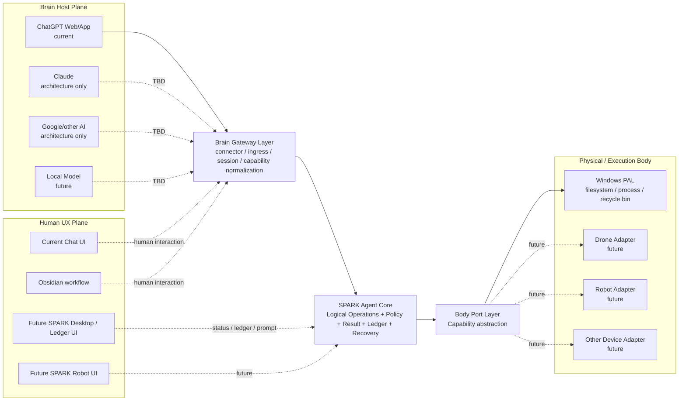

# ARCH — SPARK_Transport

**Version:** 0.0.0  
**Status:** Sprint-2 Architecture Baseline / 0.0.1 Candidate  
**Architecture review:** 2026-09-12 / 1.23

## 1. Purpose and Product Boundary

SPARK_Transport는 특정 AI UI나 특정 model에 종속된 coding agent가 아니라 **AI Brain과 local/physical capability 사이의 provider-neutral Agent Core**를 제공한다.

현재 first Brain Host는 ChatGPT Web/App이고 OpenAI Secure MCP Tunnel을 통해 연결한다. 그러나 ChatGPT subscription message를 사용해 별도 model API 비용을 피하는 방식은 현재의 중요한 deployment strategy일 뿐 Core 자체의 dependency가 아니다.

장기적으로 Brain Host는 ChatGPT, Claude, Google 계열 agent, local model 또는 다른 reasoning host로 교체될 수 있고, Body는 filesystem/process에서 drone/robot/device로 확장될 수 있다.

## 2. Architecture Principles

1. **Brain independent** — ChatGPT/Claude/local model은 교체 가능한 Brain Host다.
2. **Brain Gateway boundary** — Brain별 connector, quota/session, ingress 차이는 Agent Core 앞의 Brain Gateway에서 흡수한다.
3. **Protocol independent Core** — MCP는 현재 Brain Gateway의 표준 protocol adapter이며 domain logic과 분리한다.
4. **UX independent Core** — Chat transcript, Obsidian, future SPARK Desktop/Robot UI는 Core 밖의 Human UX Plane이다.
5. **Logical operation before physical operation** — Core는 `delete_path`, `run_command` 같은 logical capability를 호출하고 실제 OS/device 동작은 Body Port/PAL adapter가 수행한다.
6. **Body independent** — Windows filesystem/process는 첫 Body implementation일 뿐이며 drone/robot/device adapter를 추가할 수 있다.
7. **Windows-first 0.0.1** — Sprint-2 physical implementation은 Windows PAL을 target으로 한다. macOS/Linux/Android/device PAL은 TBD다.
8. **Fail closed + explicit result** — 실패 시 hidden elevation/destructive fallback을 하지 않고 AI와 local user 모두에게 결과를 남긴다.
9. **Recoverability** — overwrite/modify는 pre-image recovery를 남기고 delete는 Windows에서 Recycle Bin으로 구현한다.
10. **Bounded execution** — command는 timeout, process-tree cleanup, bounded stdout/stderr를 가진다.
11. **User-visible ledger** — chat transcript만 operation history로 간주하지 않는다.
12. **No model API dependency** — SPARK_Transport daemon 자체는 OpenAI/Anthropic/Google model API를 호출하지 않는다.

## 3. Top-level System Context



### 3.1. Current OpenAI deployment

```text
ChatGPT Web/App
  -> OpenAI Secure MCP Tunnel
  -> MCP 2026-07-28 Adapter
  -> SPARK Agent Core
  -> Windows Body Ports
  -> local filesystem/process/Recycle Bin
```

### 3.2. Future Claude deployment — architecture only

```text
Claude / Claude Desktop
  -> Claude Custom Remote MCP ingress
  -> MCP Adapter
  -> same SPARK Agent Core
```

Claude runtime implementation/test는 0.0.1 scope가 아니다.

## 4. Brain Gateway Layer

Brain Gateway는 **AI Brain과 SPARK Agent Core 사이의 Anti-Corruption Layer**다. Model reasoning 자체를 구현하지 않는다.

책임:

- Brain Host별 connector/ingress 차이 격리
- standard protocol adaptation
- capability/tool discovery surface
- session/client identity normalization
- approval/confirmation metadata 전달 가능성
- host-specific quota/cost/status metadata의 optional observation
- Brain Host 교체 시 Agent Core contract 보호

현재 구현:

- MCP `2026-07-28` Streamable HTTP adapter
- OpenAI Secure MCP Tunnel deployment adapter

Architecture-only future adapter:

- Claude Custom Remote MCP
- Google/Antigravity MCP
- local MCP/IPC/HTTP host

### 4.1. BrainHost contract — conceptual

```text
BrainHost / Connector
  capabilities
  client/session identity
  tool discovery
  tool invocation
  result delivery
  approval/confirmation metadata when available
```

SPARK_Transport는 consumer subscription credential을 탈취하거나 unsupported OAuth reuse를 하지 않는다. 각 Brain Host가 공식적으로 지원하는 connector/MCP path만 사용한다.

## 5. Human UX Plane

UX는 Brain Gateway/Agent Core 위에 놓이는 별도 plane이며 execution security boundary가 아니다.

Future SPARK UX는 chat transcript에 모든 상태를 섞지 않고 다음 view를 독립적으로 제공할 수 있다.

```text
Conversation | Task / Plan
Operation Ledger | Artifacts
Workspace | Status / Approval
```

현재 Obsidian 의존은 optional workflow다. Future SPARK Desktop이나 SPARK Robot UI가 이를 대체해도 Core contract는 변하지 않아야 한다.

## 6. SPARK Agent Core

### 6.1. FileService

- `list_directory`
- `read_file`
- `create_file`
- `write_file`
- `modify_file`
- `create_directory`
- `copy_path`
- `move_path`
- `delete_path`

### 6.2. ProcessService

0.0.1의 `run_command`는 **simple native CLI/process execution**만 담당한다.

- `run_command`
- future: `start_process`
- future: `process_status`
- future: `process_output`
- future: `stop_process`

GUI screen/mouse/keyboard 제어는 0.0.1에 포함하지 않는다.

### 6.3. StatusService

- health
- lifecycle status
- recent operation ledger
- future: long-output/report handles

## 7. Policy / Result / Ledger / Recovery

Brain/transport/Body implementation과 무관하게 공통 semantics를 보장한다.

- allowed-root authorization
- path canonicalization and traversal/symlink/junction defense
- mutation recovery
- normalized result
- operation ledger
- secret/private state separation
- future approval policy

## 8. Body Port Layer

Core는 OS/device API를 직접 호출하지 않고 logical port를 사용한다.

Current target ports:

```text
PlatformFilePort
PlatformTrashPort
PlatformProcessPort
PlatformPermissionPort
PlatformInfoPort
```

Future physical ports:

```text
PlatformComputerPort
DronePort
RobotPort
SensorPort
ActuatorPort
```

이 layer 때문에 `delete_path`는 Windows Recycle Bin, 향후 다른 OS의 recoverable-trash 구현으로 매핑될 수 있고, 동일한 Agent Core가 file operation 외 physical actuation으로 확장될 수 있다.

## 9. Authorization Model

### 9.1. Working directory != authorization boundary

`cwd`는 process의 시작 위치일 뿐 filesystem sandbox가 아니다.

```text
workingDirectory != authorizationRoot
```

현재 0.0.1은 single allowed root로 시작하지만 Core contract는 future multi-root/capability policy로 확장 가능해야 한다.

### 9.2. Filesystem negative cases

- `..`
- absolute/drive-qualified path
- UNC path
- symlink escape
- NTFS junction escape
- non-existing target parent-chain escape

### 9.3. Command execution trust statement

0.0.1의 `run_command`는 trusted local PoC capability다.

- native, non-elevated current-user process
- cwd must be inside allowed root
- shell parsing disabled unless caller explicitly invokes a shell executable
- timeout and process-tree cleanup
- bounded stdout/stderr
- no automatic UAC/RunAs
- **cwd confinement is not an OS filesystem sandbox**
- child process가 current-user 권한으로 outside-root resource에 접근하는 것을 0.0.1은 완전 차단한다고 주장하지 않는다

Distribution-grade OS containment는 후속 ADR 대상이다.

## 10. Normalized Result Contract

모든 logical operation은 같은 envelope를 반환한다.

```json
{
  "ok": false,
  "operationId": "op-...",
  "operation": "delete_path",
  "summary": "Deletion was not performed.",
  "changed": false,
  "data": {},
  "error": {
    "code": "PERMISSION_DENIED",
    "message": "The operating system denied the operation.",
    "platformCode": "EACCES"
  },
  "durationMs": 12,
  "requiresElevation": true,
  "retryable": false
}
```

MCP response는 compatibility를 위해 text `content`와 `structuredContent`를 모두 제공한다.

Normalized error examples:

- `NOT_FOUND`
- `ALREADY_EXISTS`
- `INVALID_ARGUMENTS`
- `OUTSIDE_ALLOWED_ROOT`
- `PATH_TRAVERSAL`
- `SYMLINK_ESCAPE`
- `PERMISSION_DENIED`
- `ELEVATION_REQUIRED`
- `RECOVERY_FAILED`
- `COMMAND_START_FAILED`
- `COMMAND_FAILED`
- `COMMAND_TIMEOUT`
- `UNSUPPORTED`

## 11. Operation Ledger

각 operation은 local append-only JSONL ledger에도 기록한다.

Minimum record:

```text
operationId
timestamp
client/session when available
operation
target/status
changed
durationMs
errorCode
summary
```

CLI `status`는 recent operations를 보여줄 수 있어야 한다. Future UX는 이 ledger를 conversation과 side-by-side로 표시할 수 있다.

## 12. Recovery and Private State

Recovery/ledger/runtime authority state는 allowed workspace와 분리하는 것을 target으로 한다.

```text
<private SPARK state>
  recovery/
  ledger/
  runtime/
```

Windows 기본 target은 user-private local state directory다. Explicit stateDir override는 test/development 용도로 허용할 수 있다.

## 13. Windows PAL — 0.0.1

### 13.1. File

Node filesystem API 또는 동등 backend를 사용하되 Core semantics는 Body Port contract를 따른다.

### 13.2. Recoverable delete

```text
delete_path
  -> PlatformTrashPort.delete()
  -> Windows Recycle Bin
```

Recycle Bin 실패 시 permanent delete fallback 금지.

### 13.3. Process

CatDesk의 process ownership design을 주요 reference로 한다.

0.0.1 acceptance는 implementation mechanism 이름보다 **검증 가능한 process-tree cleanup behavior**를 요구한다.

- non-elevated
- timeout
- child process-tree cleanup
- bounded stdout/stderr
- exit code / signal / duration
- no GUI automation

Windows Job Object는 preferred production backend이며, 0.0.1에서 equivalent verified tree-termination backend를 사용할 경우 기술부채로 명시한다.

## 14. Source Architecture Reference Decisions

세부 내용은 `ARCH_REFERENCE_STUDY.md` 참조.

### CatDesk

Adopt: process ownership, timeout/cancel cleanup, bounded output, Windows Job Object concept, logical operation 우선.

### Local Coding Agent

Adopt conceptually: working directory vs authorization roots separation, root capability, missing-target canonicalization, private authority state, local status/report indirection.

AGPL source는 license strategy 승인 없이 직접 복사하지 않는다.

### ChatGPT Local Coder

Adopt: structured result, activity/audit stream, process lifecycle decomposition. Current full-machine open permission model은 security baseline으로 채택하지 않는다.

### Jan

Future UX/client reference: provider-neutral UI, MCP host, local model, Tauri desktop separation. Cloud provider 사용은 provider API/auth와 별개다.

## 15. Brain Host Cost/Quota Strategy

Current findings와 source는 `BRAIN_HOST_COMPARISON.md`가 authoritative reference다.

Architecture rule:

- fixed-price consumer/subscription message paths가 공식 connector/MCP를 지원하면 Brain Host 후보가 될 수 있다.
- API key가 필수인 provider path는 별도 cost mode로 취급한다.
- quota 숫자는 product 정책이며 Core constant로 하드코딩하지 않는다.
- Brain Gateway는 optional quota/status metadata만 관찰할 수 있고 quota bypass를 시도하지 않는다.

## 16. Sprint-2 / 0.0.1 Scope

### In scope

- Windows filesystem/process/recycle adapter
- CRUD
- recoverable delete
- simple native execution
- timeout and process-tree cleanup
- bounded stdout/stderr
- normalized result
- operation ledger
- unified lifecycle command
- Secure MCP Tunnel regression

### Architecture only / no implementation in 0.0.1

- Claude Brain adapter
- Google/other Brain adapter
- local-model Brain adapter
- GUI Computer Use
- drone/robot adapters
- macOS/Linux/Android PAL
- elevated helper
- distribution-grade OS sandbox
- alternate SPARK Desktop/Robot UI

## 17. ADR Summary

| ADR | Decision |
|---|---|
| ADR-001 | MCP `2026-07-28` standard-only |
| ADR-002 | Brain Host는 교체 가능하고 Agent Core와 분리 |
| ADR-003 | Brain Gateway가 provider/connector 차이를 흡수 |
| ADR-004 | UX는 Agent Core 밖의 Human UX Plane |
| ADR-005 | Logical Core와 Physical Body를 Body Port/PAL로 분리 |
| ADR-006 | 0.0.1 physical target = Windows |
| ADR-007 | FileService와 ProcessService 분리 |
| ADR-008 | GUI/Computer Use는 다음 Sprint 이후 |
| ADR-009 | working directory와 authorization root 분리 |
| ADR-010 | fail closed + normalized result + operation ledger |
| ADR-011 | Windows delete = Recycle Bin, no permanent fallback |
| ADR-012 | automatic UAC/elevation 금지 |
| ADR-013 | command = timeout + verified tree cleanup + bounded output |
| ADR-014 | private state는 writable workspace와 분리하는 방향 |
| ADR-015 | quota/cost는 Brain Host policy metadata이며 Core에 하드코딩하지 않음 |
| ADR-016 | Claude/other Brain integration은 architecture-only until target test is available |
| ADR-017 | future physical capability는 Drone/Robot/Device Port로 확장 |

## 18. 0.0.1 Quality / Release Gates

0.0.1은 Small PoC milestone이며 public-distribution security certification이 아니다.

Mandatory:

- CRUD positive tests PASS
- traversal/absolute/symlink/junction negative tests PASS where platform permits fixture
- Windows Recycle Bin behavior test PASS
- no permanent-delete fallback
- command stdout/stderr/exit result PASS
- timeout PASS
- child process-tree cleanup PASS
- bounded output PASS
- normalized result PASS
- operation ledger PASS
- lifecycle PASS
- MCP discovery/call regression PASS
- Windows CI PASS
- Linux portability regression PASS for OS-neutral core paths
- GUI/Claude/Robot code 미포함

## 19. External References

- `docs/ARCH_REFERENCE_STUDY.md`
- `docs/BRAIN_HOST_COMPARISON.md`
- MCP 2026-07-28: https://blog.modelcontextprotocol.io/posts/2026-07-28/
- CatDesk: https://github.com/Xeift/CatDesk
- Local Coding Agent: https://github.com/LongNgn204/local-coding-agent
- ChatGPT Local Coder: https://github.com/posavr/chatgpt-local-coder
- Jan: https://github.com/janhq/jan

## Baseline Handoff

1.23 architecture를 0.0.1 implementation contract로 사용한다. 다음 단계는 normalized result/ledger/process cleanup을 포함한 CRUD + simple execution 구현과 Windows/Linux automated verification이다. Claude/GUI/robot integration은 구현하지 않는다.
