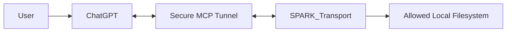
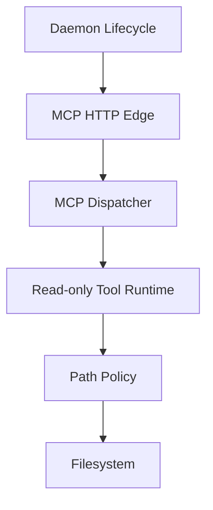
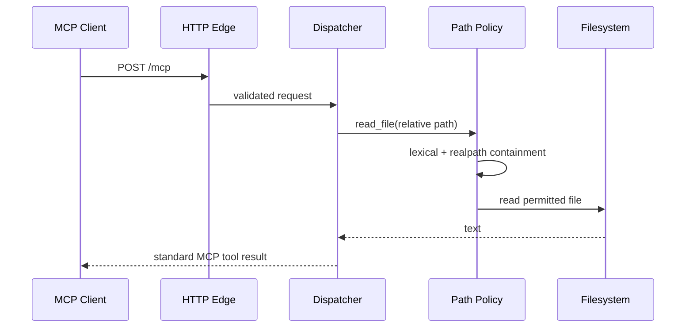
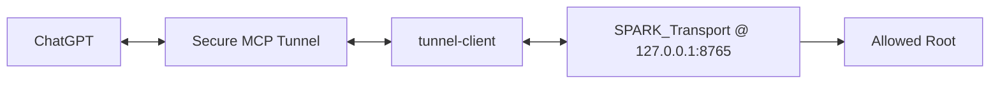

# ARCH — SPARK_Transport

**Architecture Contract**  
**Version:** 0.0.0  
**Status:** Draft / Sprint-1 구현 기준

## 0. 문서 제어

| 항목 | 값 |
|---|---|
| Project | SPARK_Transport |
| Baseline | 0.0.0 |
| Source Requirements | `docs/SWE1.md` |
| Process Ledger | `docs/SWE2.md` |
| Implementation Backlog | `docs/SWE3.md` |
| Quality Gate | `docs/ARCH_QGate.md` |
| References | `refs/MCP_2026-07-28.md` |
| Last Updated | 2026-09-12 |

## 1. 목표

SPARK_Transport는 ChatGPT와 사용자의 local filesystem 사이에서 동작하는 read-only MCP daemon/transport입니다.

Sprint-1의 목표는 다음 경로를 검증하는 것입니다.

```text
ChatGPT -> Secure MCP Tunnel -> Local MCP Daemon -> Allowed Root
```

### 1.1. 주요 요구사항

- `read_file`
- `list_directory`
- independent daemon lifecycle
- allowed-root confinement
- MCP `2026-07-28` 표준 준수
- write/delete/exec 미노출

### 1.2. 품질 목표

| 우선순위 | 목표 | 측정 기준 |
|---:|---|---|
| 1 | Filesystem containment | outside-root read 성공 0건 |
| 2 | MCP interoperability | discover/list/call protocol test 통과 |
| 3 | Least privilege | loopback/read-only/no elevation |
| 4 | 독립 실행 | daemon start/status/stop/restart 가능 |
| 5 | Maintainability | repository artifact만으로 재현 가능 |

## 2. 제약

### 2.1. 기술 제약

- MCP normative baseline: `2026-07-28`.
- 프로젝트 전용 MCP protocol extension 금지.
- OpenAI model/Responses API runtime dependency 없음.
- Secure MCP Tunnel은 control-plane 인증에 runtime API key를 사용할 수 있으나 model inference API 호출과는 별개입니다.
- Sprint-1 tool은 read-only입니다.
- local listener는 기본 `127.0.0.1`입니다.
- Node.js 20 이상을 요구합니다.

### 2.2. Process 제약

- requirement는 `SWE1.md`, 설계 결정은 `SWE2.md`, 안정된 architecture는 `ARCH.md`, 미완료 구현은 `SWE3.md`가 소유합니다.
- local test PASS를 Secure MCP Tunnel/ChatGPT E2E PASS로 간주하지 않습니다.

### 2.3. Dependency 제약

공식 MCP TypeScript SDK v2 사용을 선호합니다. Sprint-1 build 환경에서 npm registry 접근이 불가능했던 경우에도 외부 MCP contract를 변경하지 않고 표준 wire subset만 구현합니다. 이후 SDK 교체 시 외부 contract는 유지합니다.

## 3. Context and Scope

### 3.1. System Context



### 3.2. Trust / Network Boundary

- ChatGPT/OpenAI service와 Secure MCP Tunnel은 external boundary입니다.
- SPARK_Transport daemon은 local loopback에서 실행됩니다.
- filesystem 접근은 allowed-root policy가 보호합니다.

### 3.3. Interface

| ID | Interface | 방향 | Contract |
|---|---|---|---|
| IF-001 | MCP `/mcp` | tunnel/client → daemon | MCP `2026-07-28` Streamable HTTP POST |
| IF-002 | `/health` | local operator → daemon | local admin endpoint, non-MCP |
| IF-003 | filesystem | daemon → local files | Node filesystem API + path policy |
| IF-004 | future gateway | remote gateway → daemon | DEFERRED |

### 3.4. MCP Conformance Boundary

SPARK_Transport는 표준 `server/discover`, `tools/list`, `tools/call`을 사용합니다. `read_file`과 `list_directory`는 application tool이며 protocol extension이 아닙니다.

금지:

- custom MCP method
- custom protocol header
- proprietary framing
- 비표준 session/handshake semantics

## 4. Solution Strategy

| ID | Driver | Strategy | Trade-off |
|---|---|---|---|
| STR-001 | interoperability | MCP `2026-07-28` 표준만 사용 | modern client 필요 |
| STR-002 | local safety | allowed root + lexical/realpath 검사 | 기존 대상 중심 |
| STR-003 | private machine | loopback + Secure MCP Tunnel | tunnel 설정 필요 |
| STR-004 | scope safety | read-only tool 2개만 제공 | mutation은 후속 Sprint |
| STR-005 | operability | daemon lifecycle + `/health` | 별도 local process 필요 |

## 5. Building Block View



| Block | 책임 |
|---|---|
| MCP HTTP Edge | loopback, request/header 검증, HTTP response |
| MCP Dispatcher | discover/list/call dispatch와 JSON-RPC 오류 |
| Tool Runtime | `read_file`, `list_directory` |
| Path Policy | absolute/traversal/realpath escape 차단 |
| Daemon Lifecycle | start/status/stop/PID/health |

Sprint-1에는 write/delete/exec block이 없습니다.

## 6. Runtime View

### 6.1. File Read



### 6.2. 실패 처리

path policy 위반은 file 내용을 반환하지 않고 structured tool error를 반환합니다. malformed MCP request는 protocol error로 처리합니다.

### 6.3. Daemon Lifecycle

`start`는 local daemon을 시작하고, `status`는 PID와 `/health`를 확인하며, `stop`은 process 종료를 요청합니다.

## 7. Deployment View



| Node | 위치 | 상태 |
|---|---|---|
| SPARK_Transport daemon | user PC | `.runtime`에 local state |
| tunnel-client | user PC | Secure MCP Tunnel outbound connection |
| Allowed Root | user PC | explicit runtime configuration |

## 8. Cross-cutting Concepts

| Concern | Mechanism | Verification |
|---|---|---|
| Protocol | MCP `2026-07-28` | protocol test |
| Path security | absolute/traversal/realpath containment | negative test |
| Network | loopback bind | config/source review |
| Privacy | 최소 error/health 정보 | test/review |
| Secrets | repository 저장 금지 | scan/review |
| Determinism | sorted tool/directory result | test |
| Observability | health + local log | lifecycle test |

## 9. Architecture Decisions

| ADR | Status | Decision | Rationale |
|---|---|---|---|
| ADR-001 | Accepted | SPARK_Transport를 독립 repository로 운영 | daemon lifecycle과 배포 독립성 |
| ADR-002 | Accepted | MCP `2026-07-28` 표준만 사용 | protocol dialect 방지 |
| ADR-003 | Accepted | Sprint-1 tool은 `read_file`, `list_directory`만 제공 | 최소 위험 PoC |
| ADR-004 | Accepted | relative path + lexical/realpath containment | traversal/symlink escape 차단 |
| ADR-005 | Accepted | non-MCP `/health` + daemon lifecycle | 운영 상태와 MCP protocol 분리 |
| ADR-006 | Accepted | Secure MCP Tunnel을 Sprint-1 remote 연결 방식으로 사용 | localhost 직접 연결 불가 |
| ADR-007 | Proposed | package 접근 가능 시 공식 SDK v2로 내부 구현 교체 | 외부 contract 유지 |

## 10. Quality Requirements

| Scenario | 기대 결과 | Evidence |
|---|---|---|
| QS-001 root 내부 read | 정확한 UTF-8 내용 | automated test |
| QS-002 nested list | 정상/결정적 목록 | automated test |
| QS-003 traversal | 거부 | negative test |
| QS-004 absolute path | 거부 | negative test |
| QS-005 symlink escape | 거부 | negative test |
| QS-006 wrong type/missing | structured error | automated test |
| QS-007 discovery | read/list만 표시 | protocol test |
| QS-008 MCP request | discover/list/call 성공 | protocol test |
| QS-009 lifecycle | start/stop/restart 성공 | lifecycle test |
| QS-010 ChatGPT E2E | 실제 두 tool 호출 | 외부 integration pending |

## 11. Risks and Technical Debt

| ID | 항목 | Severity | 조치 |
|---|---|---:|---|
| RISK-001 | Secure MCP Tunnel + 실제 ChatGPT 호출 미검증 | High | target workspace에서 E2E 실행 |
| RISK-002 | build 환경에서 공식 SDK 설치 불가 가능성 | Medium | package 접근 시 SDK migration |
| RISK-003 | Windows junction 동작 target 검증 필요 | Medium | Windows에서 test 재실행 |
| RISK-004 | ChatGPT custom MCP beta 정책/UI 변경 가능 | Medium | release마다 공식 문서 확인 |
| DEBT-001 | Windows/macOS CI 미구성 | Medium | 향후 CI 작업 |

## 12. Glossary

| 용어 | 정의 |
|---|---|
| SPARK_Transport | local MCP daemon/transport project |
| MCP | Model Context Protocol |
| Allowed Root | tool이 접근 가능한 filesystem 최상위 경계 |
| Secure MCP Tunnel | private/local MCP server를 ChatGPT와 연결하는 OpenAI tunnel |
| Local Health Endpoint | `/health`; MCP가 아닌 daemon 운영 endpoint |

## 13. Agent Role and Orchestration View

| Role | Input | Output | Authority Boundary |
|---|---|---|---|
| Architecture | SWE1 + refs | ARCH/ADR | 제품 목적 변경 불가 |
| Implementation | ARCH + SWE3 | source/tests | protocol extension 임의 추가 금지 |
| Verification | ACC/QS + build | evidence | acceptance 의미 변경 금지 |
| Architecture Peer | ARCH + QGate | independent finding | 작성자와 독립 |
| Human | 전체 evidence | risk/baseline decision | 최종 authority |

## 14. External References

`refs/MCP_2026-07-28.md`를 참조합니다. MCP specification은 protocol behavior의 기준이며 OpenAI 문서는 ChatGPT/Secure MCP Tunnel host integration 제약을 정의합니다.

## Baseline Handoff

- Sprint-1 source와 local test는 본 Architecture와 대응합니다.
- Secure MCP Tunnel → ChatGPT 실제 E2E evidence는 아직 필요합니다.
- 최종 Architecture QGate PASS에는 independent reviewer가 필요합니다.
- Sprint-2의 mutation/exec 기능은 Sprint-1 source/tool discovery에 존재하지 않습니다.
